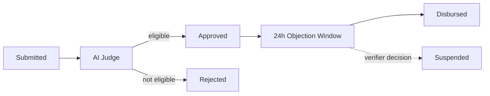
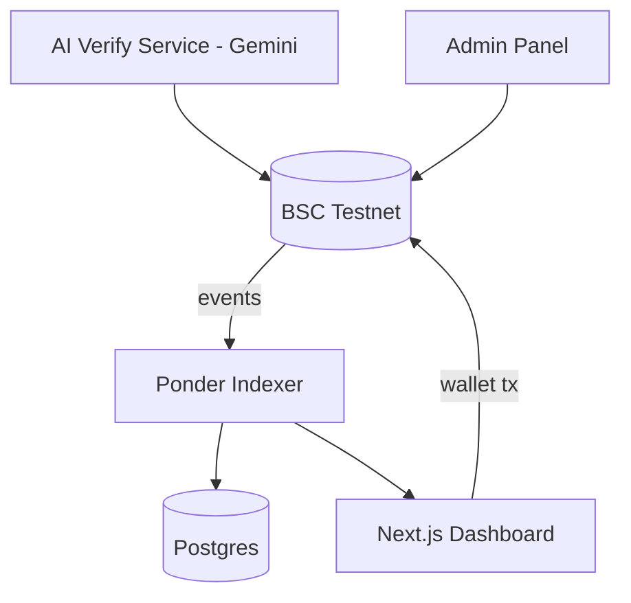

# BanSosChain

A public, on-chain proof layer for social-aid disbursements — verifiable by anyone.

Built for Indonesia Web3 Hackathon 2026.

- **Live dashboard:** https://bansoschain.vercel.app
- **Demo video:** (paste your YouTube link here)
- **Contracts (BSC Testnet):**
  - DisbursementPool: [`0x58Cb1E7Cc9C5812afb586E77c72bc452D3a528BC`](https://testnet.bscscan.com/address/0x58Cb1E7Cc9C5812afb586E77c72bc452D3a528BC)
  - BeneficiaryRegistry: [`0xf726b1978003DB342492e29D3396C9Fe9271970C`](https://testnet.bscscan.com/address/0xf726b1978003DB342492e29D3396C9Fe9271970C)

## Problem

Social-aid programs in Indonesia face recurring allegations of misuse, with little public accountability. Official portals show only a recipient's name, income decile, and status — no amount, and no proof that a disbursement actually happened.

## Solution

BanSosChain is a proof-of-disbursement layer built on top of the existing system, not a replacement for it. Every aid application moves through a clear flow: submitted, assessed by an AI judge, approved by a verifier, held through a 24-hour objection window, then actually transferred on-chain to the recipient's wallet. Every step produces a transaction anyone can verify on BscScan.



## Architecture



## Repo structure
## Running locally

Each folder has its own dependencies. Broadly:

```bash
# Contracts
cd SmartContract && forge test

# Indexer
cd ponder && npm install && npm run dev

# Frontend
cd frontend && npm install && npm run dev
```

You'll need your own RPC URL and deployed contract addresses in each `.env` — see `.env.example` where present. Never commit real private keys.

## Known limitations

- The AI judge is a single point of trust — no second opinion or human gate before a verdict executes on-chain.
- `ajukanSanggahan()` (submit objection) is permissionless and could be spammed.
- Key custody for identity hashing (`idHash`) is not finalized for production data.
- `metadataURI` currently points to a public Gist — fine for test data, not for real citizen data.

## Team

Solo build — [@tronic21-ctrl](https://github.com/tronic21-ctrl)
