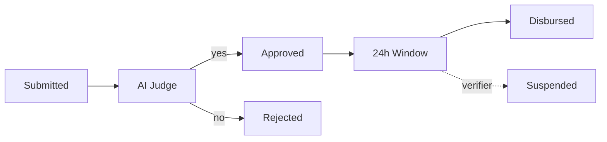
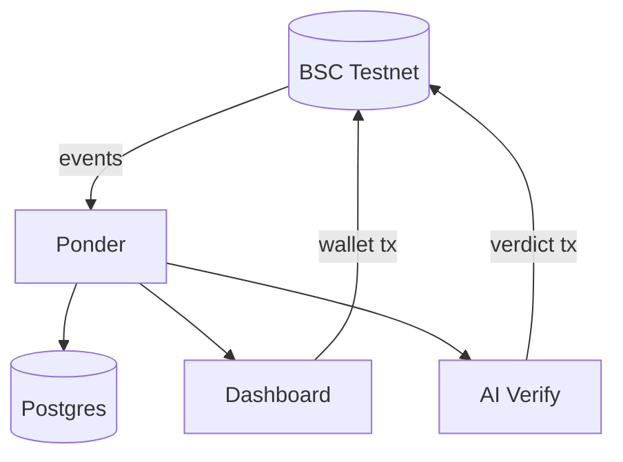

# BanSosChain

A public, on-chain proof layer for social-aid disbursements — verifiable by anyone.

Built for Indonesia Web3 Hackathon 2026.

- **Live dashboard:** https://bansoschain.vercel.app
- **Demo video:** (paste your YouTube link here)
- **Contracts (BSC Testnet):**
  - DisbursementPool: [`0x58Cb1E7Cc9C5812afb586E77c72bc452D3a528BC`](https://testnet.bscscan.com/address/0x58Cb1E7Cc9C5812afb586E77c72bc452D3a528BC)
  - BeneficiaryRegistry: [`0xf726b1978003DB342492e29D3396C9Fe9271970C`](https://testnet.bscscan.com/address/0xf726b1978003DB342492e29D3396C9Fe9271970C)

## Problem

Social-aid programs in Indonesia face recurring allegations of misuse, with little public accountability. One live example: in Maluku Tengah, prosecutors opened a corruption investigation in October 2025 into a 2023 regional social-aid program worth IDR 9.7 billion (about USD 540,000). Investigators allege the aid applications were not evaluated by the responsible agency, as regulations require. As of mid-2026, more than 400 people had been questioned, no suspect had been publicly named, and the state's loss had not yet been calculated. Meanwhile, the national aid-checking portal (cekbansos.kemensos.go.id) shows only a recipient's name, income decile, and status: no amount, and no proof that a disbursement happened. Citizens and independent auditors cannot verify a disbursement claim on their own.

## Solution

BanSosChain is a proof-of-disbursement layer built on top of the existing system, not a replacement for it. Every aid application moves through a clear flow: submitted, assessed by an AI judge, approved by a verifier, held through a 24-hour objection window, then actually transferred on-chain to the recipient's wallet. Every step produces a transaction anyone can verify on BscScan, no permission or special access required.

## What Is Real and What Is Simulated

- **Real:** two smart contracts deployed and verified on BSC Testnet, every transaction shown on the dashboard in Live mode, the AI eligibility verdicts, and the 24-hour objection window.
- **Simulated:** the applicants (synthetic profiles for a Maluku Tengah scenario) and the token (mDANA, a mock token with no monetary value).
- The real Maluku Tengah investigation is cited only as motivation. BanSosChain makes no claim about that case, and allegations remain allegations until decided by the courts.

## How It Works



Objections are recorded on-chain as signals. They never suspend a recipient automatically — a verifier reviews and decides.

## Architecture



## Contracts

- **BeneficiaryRegistry:** recipient registry, status tracking (Pending, Verified, Rejected, Suspended), idHash as a privacy-preserving key
- **DisbursementPool:** aid programs, fund disbursement, 24-hour objection window, per-transaction cap, per-program kill switch

Token-agnostic by design: the program token is a plain address, so USDT or IDRX can be used instead of the mock token.

## Design Decisions

- No upgradeable proxy: the owner cannot silently change the rules after deployment.
- `cairkan()` is permissionless (a keeper pattern): anyone can trigger a disbursement, but funds always go to the recipient wallet on record.
- Ownable2Step on both contracts, custom errors decoded into readable messages in the UI.
- Verified on BscScan (Exact Match), 19 tests, 100% branch coverage.
- AI verdicts come from an off-chain LLM (Gemini) and are written on-chain by a relayer. The service re-reads on-chain status before acting, so a lagging indexer cannot cause duplicate approvals.

## Known Limitations and Next Steps

- The AI judge is a single point of trust. Next: a second-opinion model plus a human verifier gate before approval.
- `ajukanSanggahan()` (submit objection) is permissionless and unrated, so it can be spammed. Next: rate limits or reporter reputation.
- Key custody for identity hashing (`idHash`) is not finalized. Next: a designated key holder, then zero-knowledge proofs so eligibility can be proven without revealing identity.
- `metadataURI` points to a public Gist with no on-chain integrity hash. Fine for test data, not for real citizen data. Next: store a content hash on-chain and move to encrypted storage.
- Verifiers cannot be revoked, there is no global pause, and suspensions carry no on-chain reason. Next: add all three.
- Next: validate the flow with a real regional social-affairs agency.

## Repo structure
## Running locally

Each folder has its own dependencies. Broadly:

```bash
# Contracts
cd SmartContract && forge test

# Indexer
cd ponder && npm install && npm run dev

# Frontend
cd frontend && npm install && npm run dev
```

You'll need your own RPC URL and deployed contract addresses in each `.env` — see `.env.example` where present. Never commit real private keys.

## Sources

- [Kompas: Maluku Tengah social-aid investigation update, June 2026](https://regional.kompas.com/read/2026/06/12/085412678/kasus-korupsi-bansos-rp-97-miliar-110-saksi-mangkir-undangan-klarifikasi)
- [Tribun Ambon: Kejari statement on unevaluated applications, November 2025](https://ambon.tribunnews.com/masohi/95109/calon-tersangka-kasus-bansos-dinas-koperasi-dan-ukm-malteng-kajari-sebut-tunggu-tanggal-main)

## Team

Solo build — [@tronic21-ctrl](https://github.com/tronic21-ctrl)
